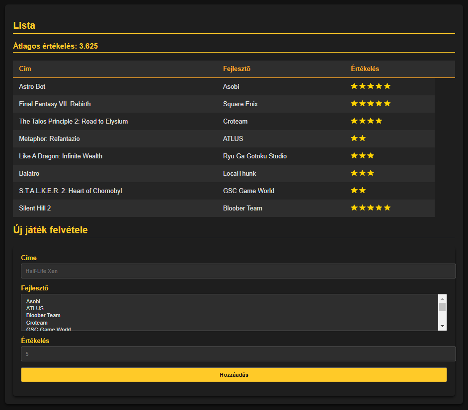

# Webprogramozás 2024-2025-1 PHP ZH

A `TASKS.MD` fájlban jelöljétek be, hogy mely feladatokat végeztétek el!

Az eredményeket küldjétek a `babuafi@inf.elte.hu` e-mail címre.

## A feladat

A fájlok között találsz egy `games.json` nevű fájlt, ebben játékok adatait találod.

A játékokról a következő információkat tároljuk:
- id: A játék azonosítója.
- title: A játék címe.
- developer: A játék fejlesztője.
- rating: A játék értékelése.

A `zh2.php` fájlban találsz egy űrlapot, ezt lehet használni új játékok felvételére. 

1. **Az űrlapon a felhasználó a "$game_developers" változóban található fejlesztők közül tudjon választani.** (1 pont)

Ehhez generáld be az opciókat a `developers` azonosítójú "select" elembe.

2. **Olvasd be az összes játékot egy tömbbe és az "average_rating" azonosítójú elembe írasd ki
a játékok értékeléseinek átlagát.** (1 pont)

A betöltéshez célszerű a `Storage.php`-ben található segédosztályokat használni.

3. **Listázd ki a játékokat a "game_list" azonosítójú táblázat "tbody"-ja alá.** (2 pont)

Ott találhatsz egy példát arra, hogy egy játékhoz milyen struktúrájú HTML-nek kell tartoznia.
Jelenjen meg a játék címe, fejlesztője és az értékelése is.

Az értékelés a megjelenített csillagok számával legyen jelezve. Az értékelésnek megfelelő számú csillagot generálj.

4. **Az űrlap használatával lehessen új játékot regisztrálni.** (1.5 pont)

A regisztrációval a játék kerüljön be a "games.json" fájlba.

Segítség: A következő feladatok miatt érdemes a hozzáadás lekezelését a `zh2.php` fájlban végezni.

5. **Validáció: ha az űrlapon a játék kiadója "Valve", akkor ne szerepelhessen a 3-as szám a játék címében.** (1 pont)

A címhez tartozó input mező alatt jelenjen egy hibaüzenet hiba esetén.

Mindenképpen szerveroldali validációt implementálj, a HTML5-ös validáció nem elfogadható!

6. **Validáció: az értékelés mezőbe 1 és 5 közötti számot lehessen megadni.** (1 pont)

Az értékeléshez tartozó input mező alatt jelenjen egy hibaüzenet hiba esetén.

Mindenképpen szerveroldali validációt implementálj, a HTML5-ös validáció nem elfogadható!

7. **Legyen állapottartó az űrlap, azaz a megadott inputok legyenek kitöltve
ha éppen lett beküldve új játék.** (1 pont)

Fontos, hogy mindhárom mező legyen állapottartó:
- Cím
- Fejlesztő
- Értékelés

8. **Legyen lehetőség játékok módosítására.** (1.5 pont)

Ha a felhasználó olyan játékcímet ad meg az űrlapon, ami már szerepel az adatbázisban akkor új játék létrehozása helyett
módosítsd a már létező játék "developer" és "rating" mezőjét.

A frissített lista egyből legyen látható a felhasználó számára.

+1 **Legyen lehetőség a játékok cím és fejlesztő szerinti rendezésére.** (1 pont)

Ehhez helyezz el két linket, amelyekre kattintva adj át egy paramétert a `zh2.php` oldalnak.
A paraméter alapján rendezd a játékokat tartalmazó táblázatot ABC rendben a cím vagy fejlesztő szerint.

